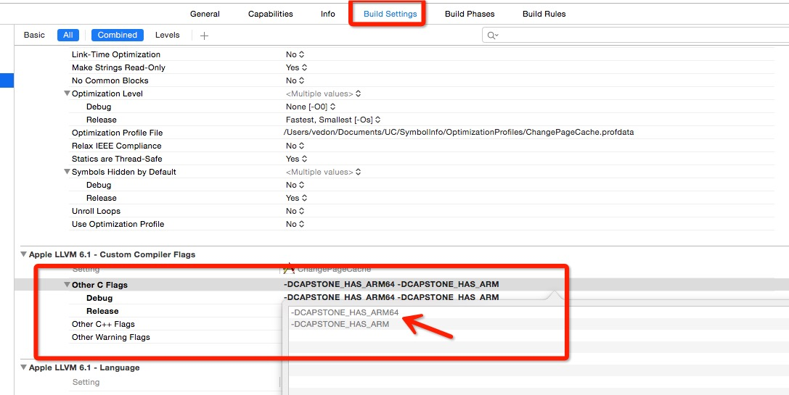
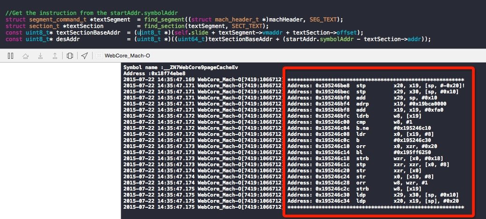

##Assemble Instruction

在终端，我们可以通过otool -l 来查看Mach－O 文件的汇编代码。我们能否在运行时也获取到需要的汇编代码，来实现特定的目的呢。答案是肯定的，我写的上一篇文章[Digging the WebCore Mach-O file](https://github.com/vedon/Mach-O/blob/master/Mach-O%20OverView%20(WebCore)/WebCore_Mach-O%20%20digging.md)里面可以获得特定符号在运行时的地址，在通过[Capstone](https://github.com/aquynh/capstone) ，我们可以得到需要的汇编代码。

```

NSArray *fetchAssembleInstructions(const struct mach_header_t *machHeader, const uint8_t *buffer ,uint64_t bufferSize,uint64_t offset ,uint64_t symbolDataLength)
{
    NSMutableArray *assembleInstructions = [NSMutableArray array];
    csh cs_handle       = 0;
    cs_insn *cs_insn    = NULL;
    size_t disasm_count = 0;
    cs_err cserr;
    
    cs_arch target_arch;
    cs_mode target_mode;
    switch (machHeader->cputype)
    {
        case CPU_TYPE_I386:
            target_arch = CS_ARCH_X86;
            target_mode = CS_MODE_32;
            break;
        case CPU_TYPE_X86_64:
            target_arch = CS_ARCH_X86;
            target_mode = CS_MODE_64;
            break;
        case CPU_TYPE_ARM:
            target_arch = CS_ARCH_ARM;
            target_mode = CS_MODE_ARM;
            break;
        case CPU_TYPE_ARM64:
            target_arch = CS_ARCH_ARM64;
            target_mode = CS_MODE_ARM;
            break;
        default:
            NSLog(@"Can't find the CPU type");
            break;
    }
    
    cs_opt_mem mem = {
        .malloc = &malloc,
        .calloc = &calloc,
        .realloc = &realloc,
        .free = &free,
        .vsnprintf= &vsnprintf
    };
    cs_option (cs_handle, CS_OPT_MEM, (size_t)&mem);
    if ( (cserr = cs_open(target_arch, target_mode, &cs_handle)) != CS_ERR_OK )
    {
        NSLog(@"Init Capston failed: %d, %s.", cserr, cs_strerror(cs_errno(cs_handle)));
    }else
    {
        if (machHeader->cputype == CPU_TYPE_ARM)
        {
            switch (machHeader->cpusubtype)
            {
                case CPU_SUBTYPE_ARM_V7:
                case CPU_SUBTYPE_ARM_V7F:
                case CPU_SUBTYPE_ARM_V7S:
                case CPU_SUBTYPE_ARM_V7K:
                case CPU_SUBTYPE_ARM_V8:
                    cs_option(cs_handle, CS_OPT_MODE, CS_MODE_THUMB);
                    break;
                default:
                    cs_option(cs_handle, CS_OPT_MODE, CS_MODE_ARM);
                    break;
            }
        }
        
        cs_option(cs_handle, CS_OPT_DETAIL, CS_OPT_ON);
        cs_option(cs_handle, CS_OPT_SKIPDATA, CS_OPT_ON);
        cs_option(cs_handle, CS_OPT_SYNTAX, CS_OPT_ON);
        
        disasm_count = cs_disasm(cs_handle, buffer, (size_t)bufferSize, offset, (size_t)symbolDataLength, &cs_insn);
        
        NSLog(@"*********************************************************");
        for (size_t i = 0; i < disasm_count; i++)
        {
            NSString *mnemonic = [NSString stringWithUTF8String:cs_insn[i].mnemonic];
            NSString *opStr = [NSString stringWithUTF8String:cs_insn[i].op_str];
            InstructionInfo *instr = [[InstructionInfo alloc]initWithMnemonic:mnemonic opStr:opStr instructionAddr:cs_insn[i].address];
            [assembleInstructions addObject:instr];
            instr = nil;
            
            NSString *asm_string = [NSString stringWithFormat:@"%-10s\t%s", cs_insn[i].mnemonic, cs_insn[i].op_str];
            NSLog(@"Address: %p \t %@",(char *)cs_insn[i].address,asm_string);
            
        }
        cs_free(cs_insn, disasm_count);
        cs_close(&cs_handle);
        
        NSLog(@"*********************************************************");
    }
    return assembleInstructions;
}

```

把Capstone 源码集成到项目里面，还需要配置一下宏。这里只做ARM 和 ARM64 的解析。

```
-DCAPSTONE_HAS_ARM64
-DCAPSTONE_HAS_ARM
```




项目[Demo]()运行结果
