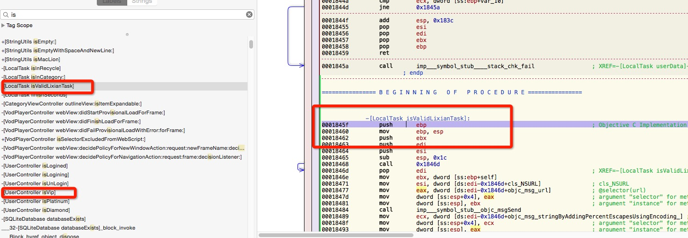
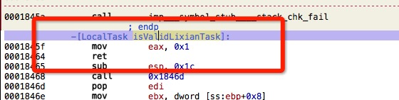
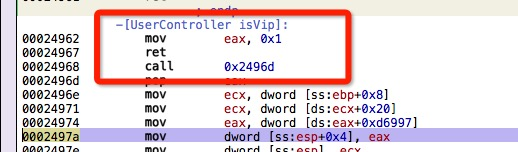
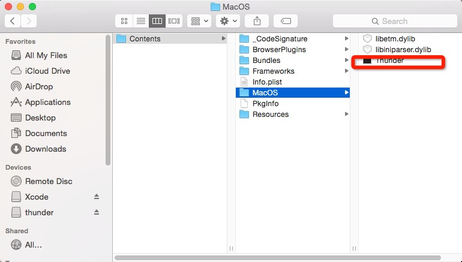

##免费迅雷离线下载

最近在看一些Mach-O 相关的东西，了解到很多之前没有涉及的领域的知识。其中最重要一点就是查找符号，修改符号段的汇编代码。 每个月的自动续费提醒，导致我想到一个方法，能不能查看迅雷是怎样判断我是否是VIP 的代码，再修改它的汇编代码。从而实现绕过它的检查。

下面是迅雷可执行文件内容截图：

寄存器有以下规则：
> * 数据寄存器（EAX、EBX、ECX、EDX）：数据寄存器主要用来保存操作数和运算结果等信息。但其也有一些约定俗成的特别作用。EAX用于存放函数返回值；EBX常用作计算存储器地址时的基址寄存器；ECX用作计数器使用，EDX一些计算中的默认参与运算寄存器。
> * 指针寄存器（EBP、ESP）：ESP常用作堆栈指针，指向栈顶维护堆栈变化；EBP用作栈基地址，主要用于维护该函数栈帧，可直接存取堆栈中的数据。
> * 变址寄存器（ESI、EDI）：它们主要用于存放存储单元在段内的偏移量。
> * 指令指针（EIP）：存放下次将要执行的指令在代码段的偏移量。

[关于esp,ebp 两个寄存器的解析](http://www.cnblogs.com/pugang/archive/2012/05/25/2518499.html)

既然eax 保存函数的返回值，那么在isVip 和isValidLiXianTask 直接修改返回值，就可以实现免费的离线下载。

最后用hopper 导出Thunder 可执行文件，替换Application 里面Thunder 的包内容。

[附件下载地址](https://github.com/vedon/Digging-Mach-O-file/blob/master/Thunder%20Digging/Thunder.zip)
